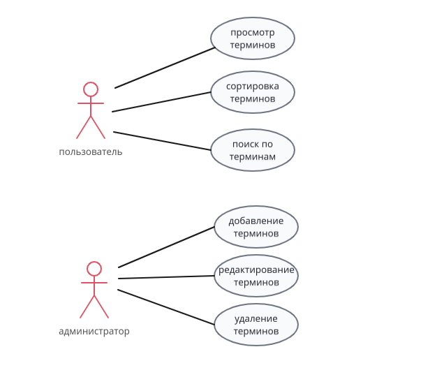

// пользовательские атрибуты
:figure-caption: Рисунок
:figure-caption-ref: рисунке
:table-caption: Таблица
:table-caption-ref: таблице
:images_dir: ./images
:appendix-caption: Приложение
:appendix-caption-ref: Приложении
// - уровень детализации документа
:detalization: 2
// - номер версии документа
:document-version: 1
// - будет ли генерироваться внутренняя документация с большей детализацией и раскрытием деталей внутренней реализации или будет генерироваться документация для внешних потребителей
// -- атрибут не объявлен — документация для внешних потребителей
// -- атрибут объявлен — внутренняя документация
//:is_internal:

// draft
// [plantuml]
// ----
// @startuml
//
// a --> b
//
// @enduml
// ----

= Диаграммы

.use-case диаграмма
[width='100%']

.доменная модель
[plantuml]
----
@startuml
left to right direction

object "термин" as trm
object "администратор" as adm
object "пользователь" as usr
object "редактирование" as edt
object "добавление" as add
object "удаление" as del
object "сортировка" as srt
object "поиск" as src

trm : название
trm : определение

usr --> src : может
src --> trm

usr --> srt : может
srt --> trm

usr --> trm : просматривает

adm --> edt : может
edt --> trm

adm --> add : может
add --> trm

adm --> del : может
del --> trm

@enduml
----

.модель данных
[plantuml]
----
@startuml
left to right direction
entity " термин" as term {
    id | <<PK>>
    --
    название
    определение
    термин удален (+/-)
}

@enduml
----

.диаграмма классов
[plantuml]
----
@startuml
class "поиск"
class "интерфейс бд"
class "интерфейс пользователя"
class "подключение"

@enduml
----

// class "интерфейс бд" - добавление, редактирование, удаление

.компонентная модель
[plantuml]
----
@startuml
left to right direction

[приложение] as app
[база данных] as db
interface "интерфейс для работы с бд" as da
interface "интерфейс пользователя" as ui

ui --> app
app -> da
da --> db

@enduml
----

